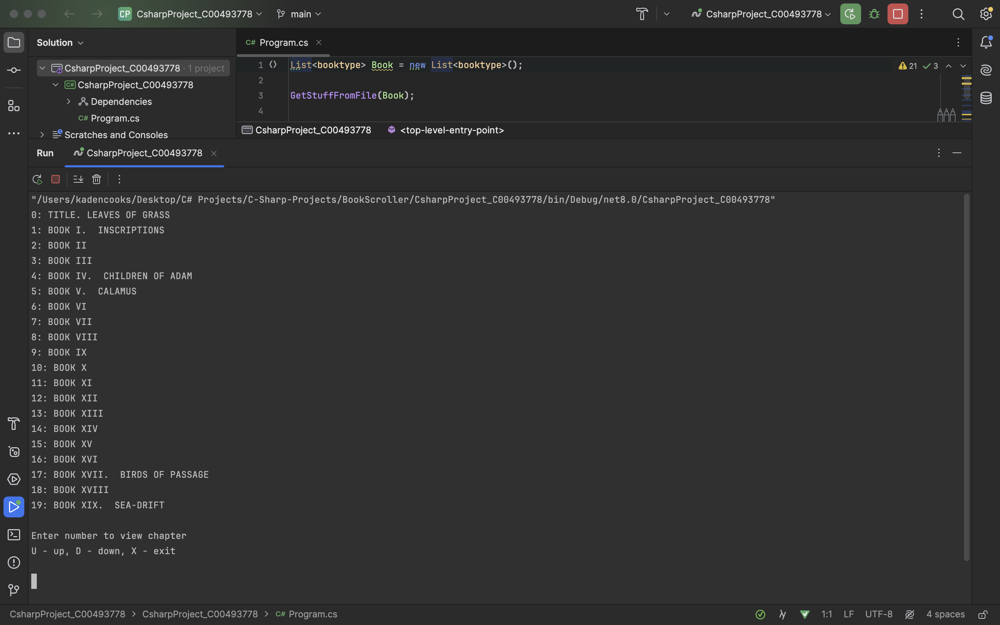
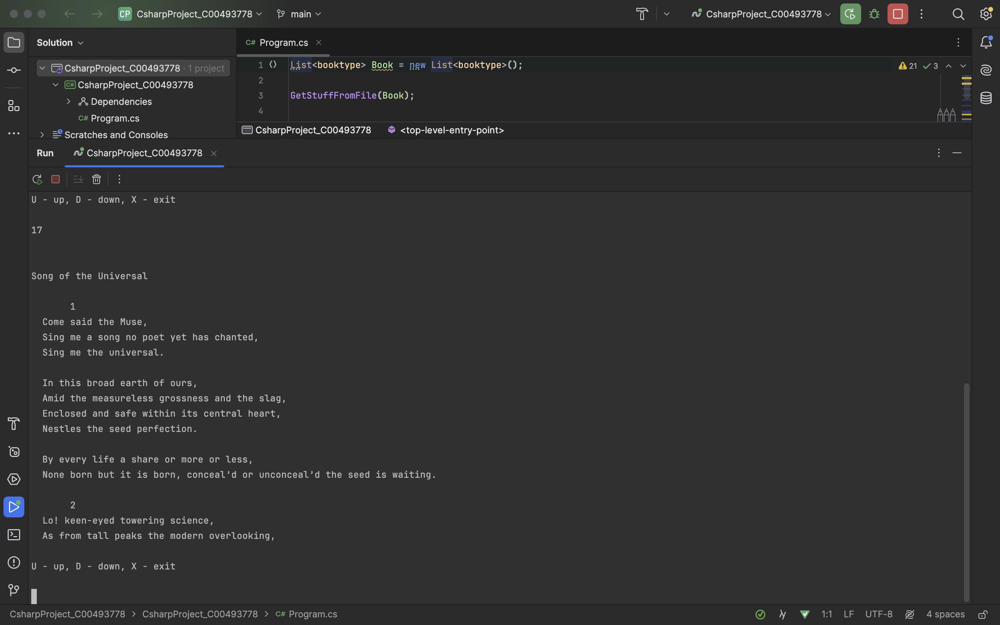
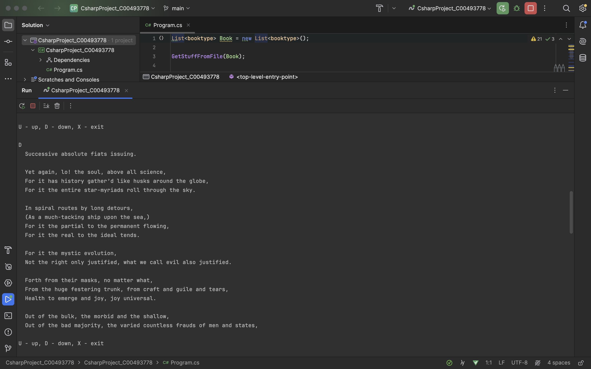
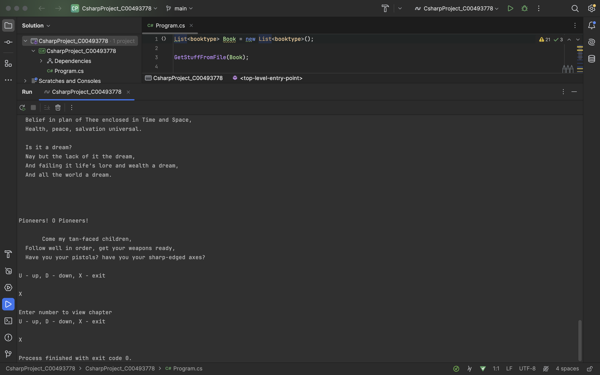

# Book Scroller
## Description:

This project acts a way to navigate a book by allowing the user to select a chapter via keyboard input as well as utilizing a scrolling mechanic that allows the user to read 20 lines at a time (the scrolling feature also is utilized when scrolling chapters). Whenever the user reaches the end of a chapter, the program will dynamically adjust to show the remaining lines so it doesn't run into an error. When the user clicks U to go up the list will readjust to show the lines shown previously so it can print out the same lines the same way again.

The code includes two different text files to show that the scroller works dynamically and isn't hardcoded to work with a specific text file size.

This project uses mainly function calls rather than hard coded to further show that this project runs dynamically. This shows that these functions can be utilized in other projects with minor changes made to them.

### Upon Launch:
- There is a menu that gives to user the option to Scroll Up, Scroll Down, Select, and Exit using U, D, a valid Integer, and X respectively
- The menu then opens again and presents the same options minus the Integer selection to allow the user to scroll through the chapter

### Test Runs:
#### Starting State

  - Menu is depicted in the starting state
 
 
  

### Chosen Chapter State

  - Menu is depicted in the state when the user inputs an integer to select a chapter. 20 lines of the chapter are outputted for the user
 
 

### Chosen Chapter and Down State

  - Menu is depicted in the state when the user clicks D on the keyboard to scroll down in the chapter
 
 

### Exit Chapter and Exit Program States

  - Menu is depicted in the state when the user clicks X on the keyboard to exit the chapter and clicks X again to exit the program

> [!NOTE]
> Program operates perfect while using U to scroll up, it shows the text you are currently on again but if you re-input U it will show another batch of the 20 lines.

